## TEMA: SecureAPI - Monitoreo de Seguridad con Notificaciones Híbridas (Push & SMTP)

Security scanning and vulnerability assessment API built with FastAPI.

## Resumen
Este proyecto describe el diseño e implementación de una API especializada en el escaneo de vulnerabilidades mediante el análisis de cabeceras HTTP. El sistema utiliza una arquitectura orientada a la gestión de proyectos de seguridad, organizando el flujo de trabajo en Milestones (hitos generales) e Issues (subtareas específicas). La innovación del sistema radica en su motor de notificaciones híbrido que integra Firebase Cloud Messaging (FCM) para alertas en tiempo real y protocolos SMTP para trazabilidad formal, optimizando la capacidad de respuesta ante hallazgos críticos.

## Objetivos del Proyecto

•	Automatización de Auditoría: Evaluar la postura de seguridad de activos web mediante el análisis de directivas de seguridad en cabeceras (HSTS, CSP, X-Frame-Options, etc.).

•	Gestión Estructurada: Implementar una jerarquía de tareas para facilitar el seguimiento de auditorías de seguridad complejas.

•	Reducción de Latencia de Respuesta: Eliminar la necesidad de "polling" o refresco manual del dashboard mediante notificaciones push inmediatas

## Definiciones de la Arquitectura del Sistema

A. Motor de Escaneo y Gestión
La API funciona bajo una estructura lógica de gestión de tareas:

• Milestones: Representan el ciclo de vida de un escaneo completo de una infraestructura o aplicación.

• Issues: Representan los vectores de ataque específicos o las cabeceras individuales que deben ser auditadas.


B. Flujo de Notificaciones en Tiempo Real (Firebase)
Firebase actúa como el canal de comunicación crítica. El flujo técnico se detalla a continuación:

1.	Detección: El backend procesa el escaneo y determina el nivel de riesgo.

2.	Inicialización: Se utiliza Firebase Admin SDK mediante una cuenta de servicio protegida.

3.	Transmisión: Se envía un payload a través de FCM al token específico del dispositivo/navegador del auditor.

4.	Payload de Datos: Incluye la URL analizada, el nivel de riesgo (Crítico, Alto, Medio, Bajo) y un resumen de hallazgos.


C. Componente de Trazabilidad (SMTP)

En paralelo a la notificación push, el sistema dispara un evento hacia un servidor de correo saliente. Este paso es fundamental para el cumplimiento normativo y el almacenamiento histórico de las alertas de seguridad, permitiendo que el equipo técnico mantenga un registro formal de cada vulnerabilidad detectada.
________________________________________

## Prerequisitos

- Python 3.11+
- make (optional, but recommended)

### Instalación y Ejecución

```bash
make run
```
Realizar lo siguiente:

1. Crear ambiente virtual en Python
2. Instalar las dependencias en el archivo `requirements.txt`
3. Iniciar la API en http://127.0.0.1:8007

### Configuración

Todas las configuraciones en el archivo: `.env`:

```dotenv
SECRET_KEY=dev-change-me-please-very-long-secret
ALGORITHM=HS256
ACCESS_TOKEN_EXPIRE_MINUTES=30
ADMIN_USERNAME=luisg
ADMIN_PASSWORD=12345
HOST=127.0.0.1
PORT=8000
```

### Configuracion de Firebase

Para habilitar las notificaciones de mensajeria de Firebase Cloud:

1. Descarga el JSON de tu cuenta de servicio de Firebase desde [Firebase Console](https://console.firebase.google.com/)
2. Colocalo en: `secureapi/keys/firebase-service-account.json`
3. Habilitar FCM en `.env`:
   ```dotenv
   FCM_ENABLED=true
   FIREBASE_SERVICE_ACCOUNT_PATH=secureapi/keys/firebase-service-account.json
   ```

Si no agregas el archivo JSON de Firebase, la aplicación se iniciará y se ejecutará con FCM deshabilitado de forma predeterminada.

### Estructura del Proyecto

```
.
├── run_api.py              # Main entry point (handles venv + deps)
├── Makefile                # Quick commands
├── .env                    # Configuration
└── secureapi/
    ├── main.py             # FastAPI app
    ├── requirements.txt    # Python dependencies
    ├── api/                # API endpoints
    ├── services/           # Business logic
    ├── database/           # DB layer
    ├── keys/               # Firebase credentials (add here)
    └── templates/          # HTML templates
```

## Desarrollo

- API runs with hot reload enabled (changes trigger automatic restart)
- Database: SQLite (`secureapi/scans.db`)
- Logs and output shown in terminal

## Solucion de Problemas

**"Permission denied" on start_api.sh:**
```bash
chmod +x start_api.sh
```

**Python not found:**
Ensure Python 3.11+ is installed and in PATH, or use `uv`:
```bash
uv run --python 3.11 run_api.py
```

## Análisis de Beneficios en Ciberseguridad

Respuesta Proactiva: La integración de FCM permite que el equipo de SOC (Security Operations Center) reaccione a vulnerabilidades críticas en segundos tras finalizar el escaneo.

Monitoreo Persistente: La combinación de Push y Email asegura que el mensaje sea recibido incluso si el usuario no tiene la aplicación abierta (Email) o si está trabajando activamente (Push).

Integridad de Datos: El uso de Firebase Admin en el backend garantiza que el envío de alertas no sea manipulable desde el lado del cliente.
________________________________________

## Consideraciones de Seguridad

Para esta implementación, se deben observar los siguientes controles:

• Gestión de Secrets: Las credenciales de la cuenta de servicio de Firebase y las contraseñas SMTP deben almacenarse en un gestor de secretos (Environment Variables) y nunca en el código fuente.

• Validación de Tokens: Implementar una rotación estricta de tokens de registro de dispositivos para evitar el envío de información sensible a terminales desautorizados.

• Cifrado: Todas las comunicaciones entre el backend, Firebase y el cliente final deben realizarse bajo túneles TLS 1.3.

## Conclusiónes

La integración de Firebase como canal de notificaciones en tiempo real, sumada a la estructura de hitos y subtareas, transforma una herramienta de escaneo pasiva en una plataforma de monitoreo dinámico. Este enfoque no solo mejora la experiencia del usuario, sino que eleva la postura de seguridad de la organización al reducir drásticamente el Mean Time to Respond (MTTR) ante posibles configuraciones defectuosas en los servicios web expuestos.

## Recomendaciones

- Implementación de "Webhooks" para Escalabilidad, si la API va a ser utilizada por otras herramientas, no se limita solo a enviar notificaciones a humanos:

Exponer una funcionalidad de Webhooks. Así, cuando el Milestone finalice, el sistema puede enviar un JSON automáticamente a un sistema de gestión de incidentes (como Jira o un SIEM). Esto convierte tu a la API en una herramienta de integración continua (DevSecOps).

- Seguridad en el Manejo de Tokens (FCM)

El envío de notificaciones Push depende de los tokens del dispositivo. Si un atacante intercepta un token, podría recibir alertas de vulnerabilidades de tu infraestructura:

Implementar un proceso de validación de propiedad del token en el backend. Antes de enviar el mensaje por Firebase Admin, verifica que el device_token registrado aún pertenece al usuario autorizado y no ha expirado o sido suplantado.

- Clasificación de Alertas (Thresholds)

Enviar correos y notificaciones push por cada "Issue" pequeño puede generar "fatiga de alertas":

Configura niveles de severidad.

o Push + Email: Solo para riesgos "Críticos" o "Altos" (ej. falta de cabecera Content-Security-Policy en un sitio transaccional).

o Solo Dashboard: Para hallazgos informativos o de bajo riesgo. Esto asegura que cuando el usuario reciba una notificación, sepa que realmente es importante.

- Ofuscación de Datos en el Payload

Firebase Cloud Messaging es un servicio de terceros. Aunque es seguro, por buenas prácticas de ciberseguridad no se recomienda enviar detalles técnicos sensibles en el texto plano del mensaje push:

En la notificación push, enviar solo un ID de hallazgo y un resumen genérico. Obliga a que el usuario tenga que autenticarse en el dashboard para ver el detalle técnico completo de la vulnerabilidad. Así proteges la información ante posibles interceptaciones en la pantalla de bloqueo del dispositivo.

- Robustez en el Servicio SMTP:

El envío de correos suele ser un punto de falla si el servidor entra en una lista negra (blacklist) o si hay errores de red:

Implementa una Cola de Mensajería (Message Queue) como RabbitMQ o Redis. Si el servicio SMTP falla, el sistema debe reintentar el envío del correo de trazabilidad sin detener el flujo principal del escaneo.

- Cumplimiento de Estándares (ISO 27001):
• Este API ayuda al cumplimiento del dominio de Gestión de Vulnerabilidades Técnicas de la norma ISO 27001

## Anexos
## API INICIADA
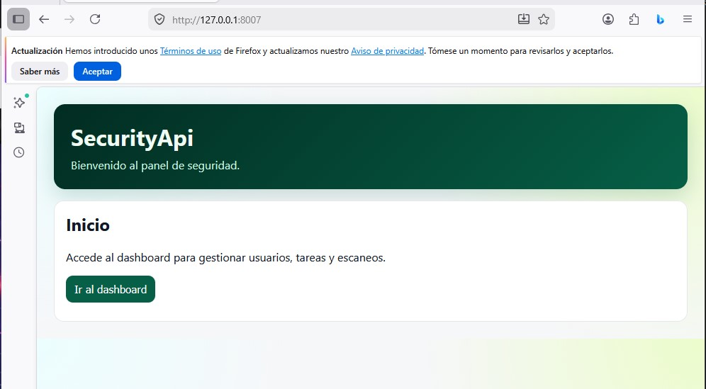
##
##
## API LOGIN
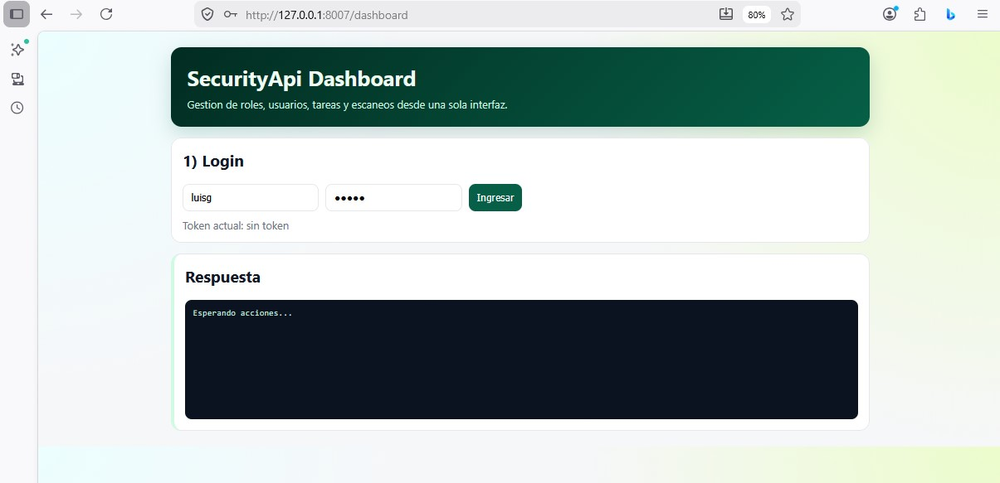
##
##
## API EN EJECUCION 
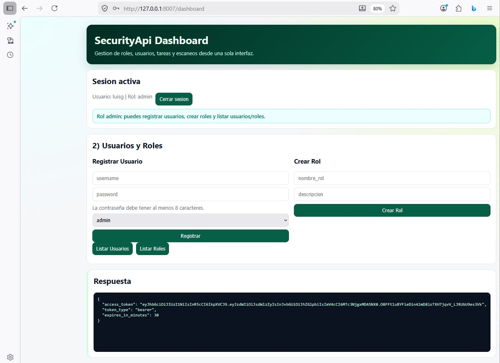
##
##
## LISTA USUARIOS 
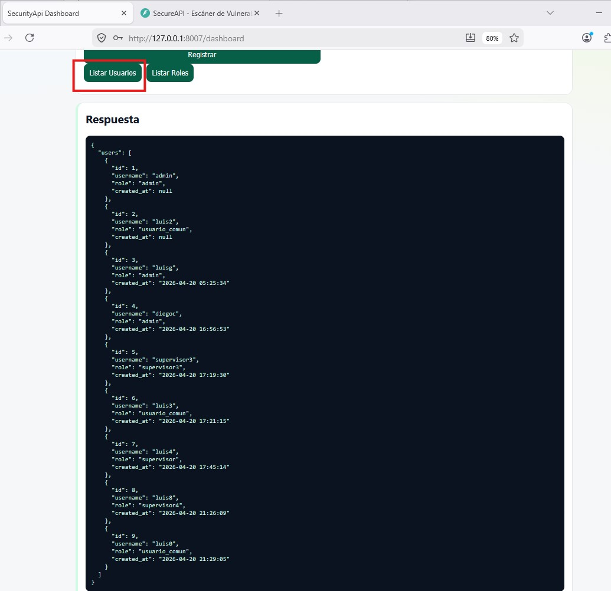
##
##
## LISTA ROLES
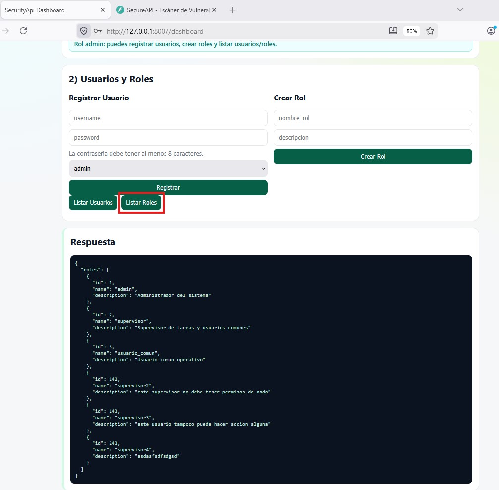
##
##
## API EN EJECUCION 

##
##
## API ESCANER
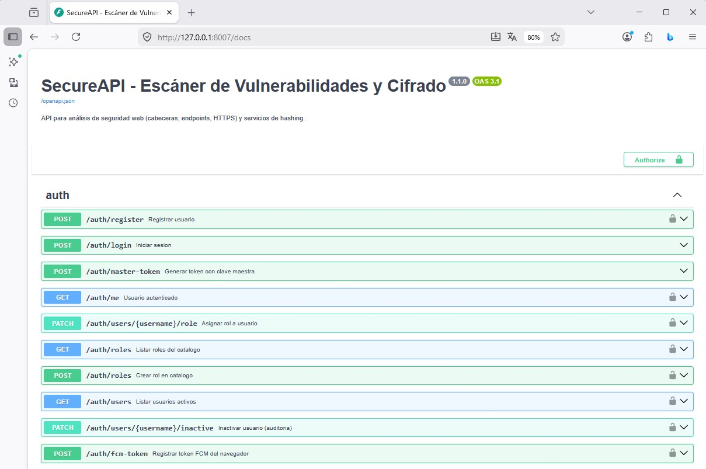
##
##
## API INGRESO LINK
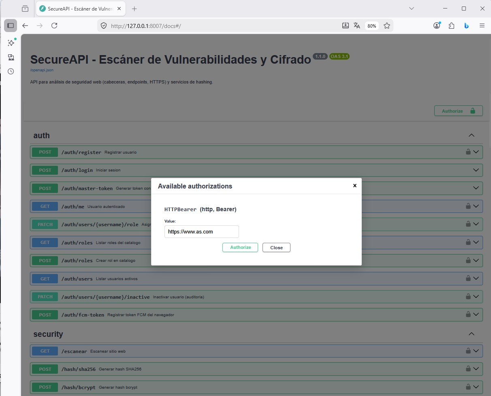
##
##
## API SCANEANDO

##
##
## API WORK
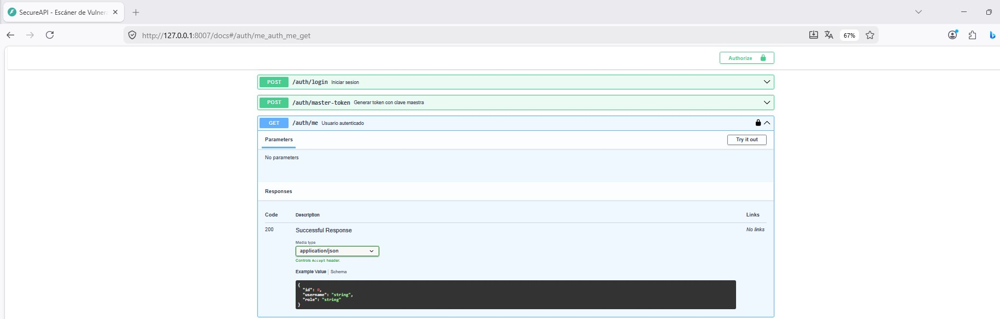
##
##
## API WORK
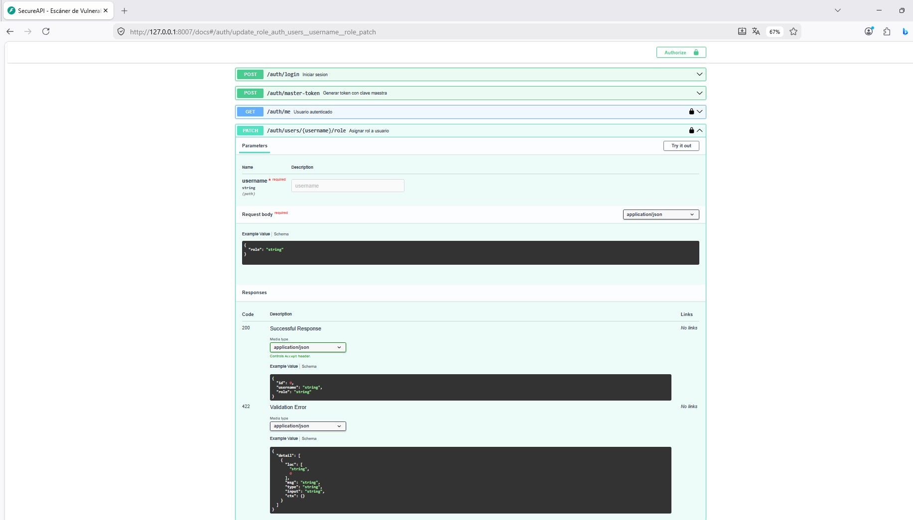
##
##
## API WORK RESULT
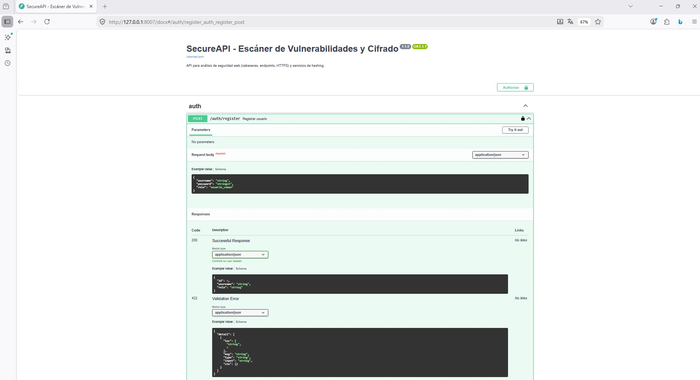
##
##
## API WORK RESULT
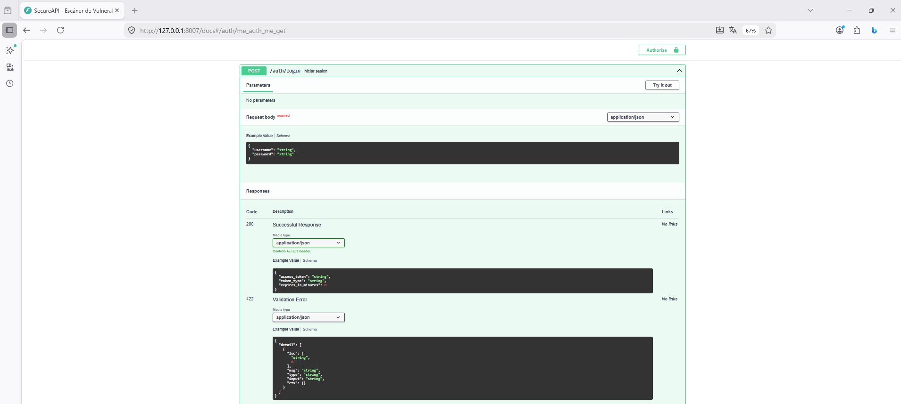
##
##
## API WORK RESULT
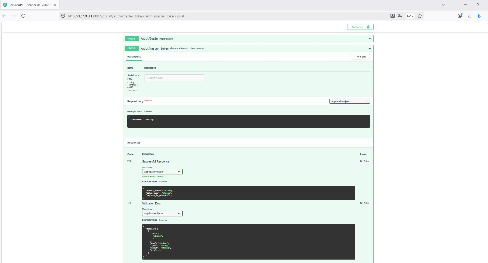
##
##
## API WORK SECURITY

##
##
## API WORK SECURITY

##
##
## API WORK TASK
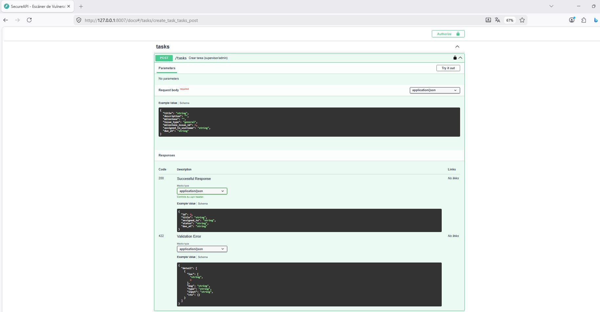
##
##
## API WORK TASK
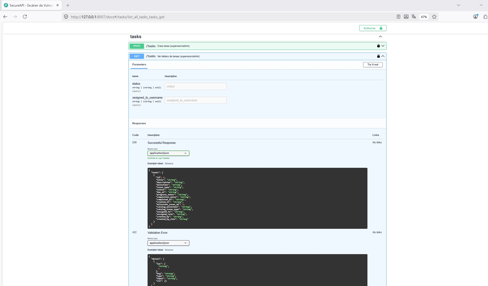
##
##
## API WORK TASK
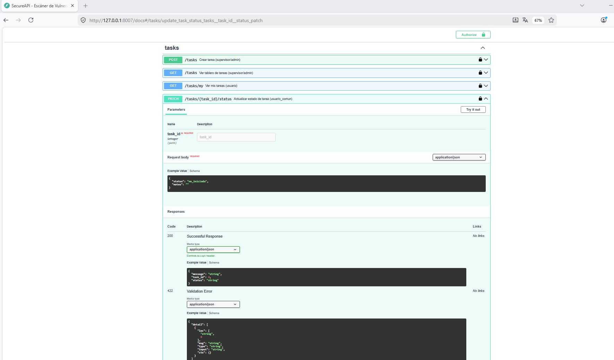